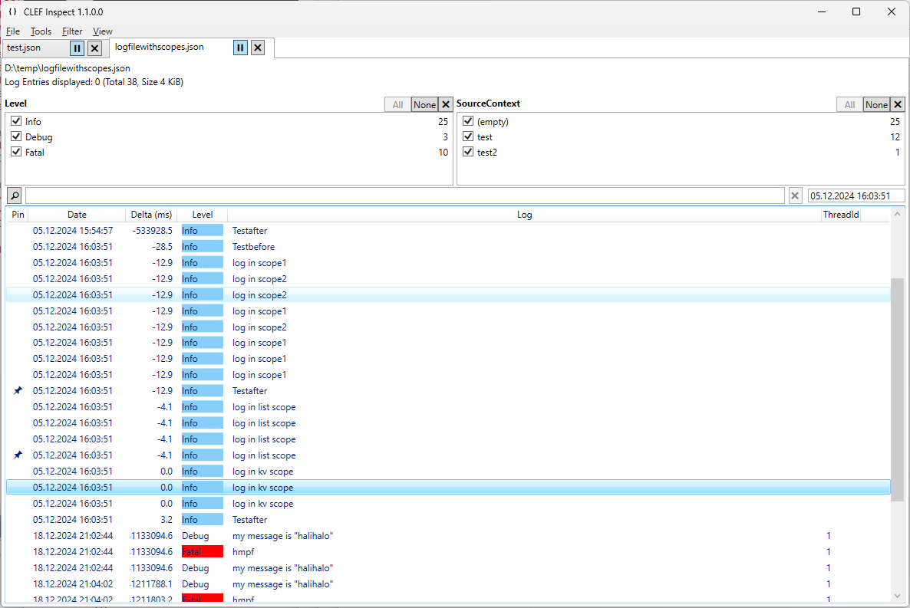

# ClefInspect

A lightweight Windows (.NET, WPF) desktop app for viewing [CLEF](https://clef-json.org/) logfiles (JSON logfiles by Serilog).

Currently runs on Windows with .NET 6.0 only. Distributed as a zip archive.

## Features

 * Displays CLEF events.
 * Add columns based on the properties available in your logfiles.
 * Filter events (text and properties) and pin (always display) individual events.
 * Scroll to events by timestamp, switch between local and UTC timestamps.
 * Show the time difference between events.
 * Can follow (tail) log files while other processes write to it.
 * Tabs
 * Copy selected events to text or JSON.

## Why ClefInspect?

There are amazing full featured log servers, analysers, and viewers for [CLEF](https://clef-json.org/).

My work with CLEF logfiles is mostly bug-hunting and timing analysis of extensive logfiles. The main task is to collect the revealing events and put them into a context. As none of the tools I found could fit my workflow perfectly, I created ClefInspect.

With ClefInspect, you can crawl the logfiles and keep the important events very efficiently by using filter -> pin -> filter -> pin.

## Future

I use ClefInspect 1.1 actively, thus i will enhance and fix every now and then. Feel free to report bugs or wishes on github.

Commercial support is available via my employer (see my github profile).

There are ideas to develop ClefInspect 2.0 for cross-platform by rewriting the WPF UI using Avalonia UI. Please contact my if you are interested to collaborate.
