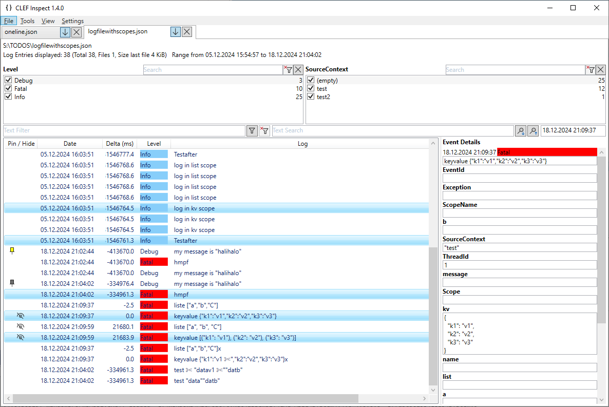

# ClefInspect

A lightweight Windows (.NET, WPF) desktop app for viewing [CLEF](https://clef-json.org/) logfiles (JSON logfiles by Serilog).

Currently runs on Windows with .NET 10.0 only. Distributed as a zip archive.

## Features

 * Displays CLEF events.
 * Show columns based on the properties available in your logfiles.
 * Filter events (text and properties) and pin (always display) individual events.
 * Auto Pin based on Pin Presets (see [Configuration](#configuration)).
 * Hide individual events, hide all events of a type (Event id)
 * Scroll to events by timestamp and search
 * Switch between local and UTC timestamps.
 * Show the time difference between events.
 * Can follow (tail) log files while other processes write to it.
 * Tabs
 * Copy selected events to text or JSON.
 * Limitation: Structured data in the logfile gets "stringified".

## Why ClefInspect?

There are amazing full featured log servers, analysers, and viewers for [CLEF](https://clef-json.org/).

My work with CLEF logfiles is mostly bug-hunting and timing analysis of extensive logfiles. The main task is to collect the revealing events and put them into a context. As none of the tools I found could fit my workflow perfectly, I created ClefInspect.

With ClefInspect, you can crawl the logfiles and keep track of important events very efficiently by pining them. A typical workflow is *filter* -> *pin* or *hide* -> *filter*.

## Usage

Use *File* -> *Open*, *open with* or *drag & drop* to open logfiles with ClefInspect. Multiple files can be opened in individual tabs or combined into one.

The text filter and text search searches in the message only by default (see *Settings* menu). It allows for multiple keywords (e.g. `users,login,logoff`) and quotes (`"a comma , here","   do not trim the spaces   "`).

Events must match all filters to be displayed (pinned events are always displayed, see *View* menu).

Use timestamp field to navigate to a event for a given time (enter a timestamp + `Enter`).

### Shortcuts

 - `Ctrl+C`: Copy selected events to clipboard (formatted, with the displayed columns)
 - `Ctrl+Shift+C`: Copy selected events to clipboard as CLEF Events
 - `Ctrl+P`: Pin selected events
 - `Ctrl+U`: Unpin selected events
 - `Del`: Hide selected events
 - `Ctrl+A` (when in the Event list): Select all displayed events
 - `Ctrl+O`: Open a logfile
 - `Ctrl+V`: Paste from clipboard
 - `Ctrl+W`: Close the active tab
 - `Ctrl+Tab`: Switch the active tab
 - `F5`: Toggle filtering
 - `F6`: Toggle display of pinned events
 - `F7`: Toggle display of hidden events
 - `F8`: Toggle hiding all events
 - `F9`: Reset View (enable filter, show pinned events, hide hidden events)

## Installation

ClefInspect is distributed in a zip. Just extract the zip to a folder of your choice (e.g. ClefInspect in your users directory).

### Configuration (optional)

You may want to put a file `ClefInspect.defaults.json` in the folder of `ClefInspect.exe`. With `"WriteableConfig": true`, ClefInspect will track recent files.

Example:

	{
	"clefFeatures": {
		"WriteableConfig": true
	},
	"viewSettings": {
		"LocalTime": true,
		"OneLineOnly": true,
		"DefaultFilterVisibility": [
		"Level",
		"SourceContext"
		],
		"DefaultColumnVisibility": [
			"ThreadId"
		],
		"DetailViewFraction": 0.33,
		"DetailView": false
		"TextSearchMsgOnly": true
	},
	"session": {
		"MaxFiles": 10,
		"Files": [
		"C:\\temp\\a.json",
		"C:\\temp\\b.json"
		]
	},
	"eventSettings": {
		"HideEventIds": [
		"5000",
		"Ax89dbCD"
		]
	},
	"pinPresets": [
		{
			"Name": "Pin Preset 1",
			"Color": "#4DA84D",
			"Enabled": true,
			"SearchText": ["booting","connecting"]
		},
		{
			"Name": "Pin Preset 2",
			"Color": "#B83579",
			"SearchText": ["some log message"]
		}
	]
	}

## Future

I use ClefInspect 1.4 actively, thus i will enhance and fix every now and then. Feel free to report bugs or wishes on github.

Commercial support is available via my employer (see my github profile).
